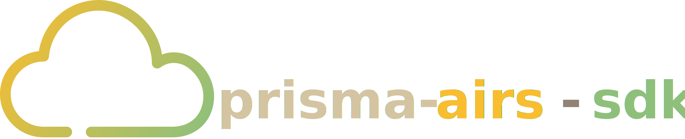

<p align="center">
  
</p>

# prisma-airs-sdk

[](https://github.com/cdot65/prisma-airs-sdk/actions/workflows/ci.yml)
[](https://github.com/cdot65/prisma-airs-sdk/actions/workflows/test.yml)
[](https://www.npmjs.com/package/@cdot65/prisma-airs-sdk)
[](https://www.npmjs.com/package/@cdot65/prisma-airs-sdk)
[](https://github.com/cdot65/prisma-airs-sdk)
[](https://www.typescriptlang.org/)
[](https://nodejs.org/)
[](https://opensource.org/licenses/MIT)

TypeScript SDK for Palo Alto Networks **Prisma AIRS** — covering the full lifecycle from configuration management to operational scanning across all three service domains: **AI Runtime Security**, **AI Red Teaming**, and **Model Security**.

## Installation

```bash
npm install @cdot65/prisma-airs-sdk
```

Requires Node.js 18+. Zero external HTTP dependencies (native `fetch` + `crypto`).

## What's Included

| Service                 | Client                | Auth    | Capabilities                                               |
| ----------------------- | --------------------- | ------- | ---------------------------------------------------------- |
| **AI Runtime Security** | `Scanner`             | API Key | Sync/async content scanning, prompt injection detection    |
| **Management**          | `ManagementClient`    | OAuth2  | Profiles, topics, API keys, apps, DLP, deployment, logs    |
| **Model Security**      | `ModelSecurityClient` | OAuth2  | ML model scanning, security groups, rule management        |
| **AI Red Teaming**      | `RedTeamClient`       | OAuth2  | Automated red team scans, reports, targets, custom attacks |

All OAuth2 services share credentials and handle token lifecycle automatically (caching, proactive refresh, 401/403 auto-retry).

## Quick Start

```ts
import { init, Scanner, Content } from '@cdot65/prisma-airs-sdk';

init({ apiKey: 'YOUR_API_KEY' });

const scanner = new Scanner();
const content = new Content({
  prompt: 'What is the capital of France?',
  response: 'The capital of France is Paris.',
});

const result = await scanner.syncScan({ profile_name: 'my-profile' }, content);

console.log(result.category); // "benign" | "malicious"
console.log(result.action); // "allow" | "block"
```

That's the API-key scanning path. The OAuth2 clients (`ManagementClient`, `ModelSecurityClient`, `RedTeamClient`), authentication setup, error handling, and runnable examples are all covered in the documentation.

## Documentation

Full docs at **[cdot65.github.io/prisma-airs-sdk](https://cdot65.github.io/prisma-airs-sdk/)**:

- [Getting Started](https://cdot65.github.io/prisma-airs-sdk/getting-started/quick-start) — installation, quick start, configuration, environment variables
- [Scan API](https://cdot65.github.io/prisma-airs-sdk/guides/scan-api) — sync/async content scanning
- [Management API](https://cdot65.github.io/prisma-airs-sdk/guides/management-api) — profiles, topics, API keys, apps, DLP, deployment, logs
- [Model Security API](https://cdot65.github.io/prisma-airs-sdk/guides/model-security-api) — model scans, security groups, rules
- [Red Team API](https://cdot65.github.io/prisma-airs-sdk/guides/red-team-api) — scans, reports, targets, custom attacks
- [OAuth Lifecycle](https://cdot65.github.io/prisma-airs-sdk/guides/oauth-lifecycle) & [Error Handling](https://cdot65.github.io/prisma-airs-sdk/developer/error-handling)
- [API Reference](https://cdot65.github.io/prisma-airs-sdk/reference/api) — generated from source

Runnable example scripts live in [`docs-site/examples/`](docs-site/examples).

## Development

```bash
npm install
npm run build          # tsup (CJS + ESM + .d.ts)
npm run test           # vitest
npm run lint           # eslint
npm run typecheck      # tsc --noEmit
```

## License

MIT
