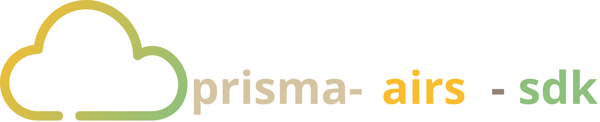

<p align="center">
  
</p>

# prisma-airs-sdk

[](https://github.com/cdot65/prisma-airs-sdk/actions/workflows/ci.yml)
[](https://github.com/cdot65/prisma-airs-sdk/actions/workflows/test.yml)
[](https://www.npmjs.com/package/@cdot65/prisma-airs-sdk)
[](https://www.npmjs.com/package/@cdot65/prisma-airs-sdk)
[](https://github.com/cdot65/prisma-airs-sdk)
[](https://www.typescriptlang.org/)
[](https://nodejs.org/)
[](https://opensource.org/licenses/MIT)

TypeScript SDK for Palo Alto Networks **Prisma AIRS** — covering the full lifecycle from configuration management to operational scanning across all four service domains: **AI Runtime Security**, **AI Red Teaming**, **Model Security**, and **AI Gateway**.

## Installation

```bash
npm install @cdot65/prisma-airs-sdk
```

Requires Node.js 18+. Zero external HTTP dependencies (native `fetch` + `crypto`).

## What's Included

| Service                 | Client                | Auth    | Capabilities                                               |
| ----------------------- | --------------------- | ------- | ---------------------------------------------------------- |
| **AI Runtime Security** | `Scanner`             | API Key | Sync/async content scanning, prompt injection detection    |
| **Management**          | `ManagementClient`    | OAuth2  | Profiles, topics, API keys, apps, DLP, deployment, logs    |
| **Model Security**      | `ModelSecurityClient` | OAuth2  | ML model scanning, security groups, rule management        |
| **AI Gateway**          | `AIGatewayClient`     | OAuth2  | SCM-managed gateway telemetry and configuration            |
| **AI Red Teaming**      | `RedTeamClient`       | OAuth2  | Automated red team scans, reports, targets, custom attacks |

All OAuth2 services share credentials and handle token lifecycle automatically (caching, proactive refresh, 401/403 auto-retry).

## Quick Start

```ts
import { init, Scanner, Content } from '@cdot65/prisma-airs-sdk';

init({ apiKey: 'YOUR_API_KEY' });

const scanner = new Scanner();
const content = new Content({
  prompt: 'What is the capital of France?',
  response: 'The capital of France is Paris.',
});

const result = await scanner.syncScan({ profile_name: 'my-profile' }, content);

console.log(result.category); // "benign" | "malicious"
console.log(result.action); // "allow" | "block"
```

That's the API-key scanning path. The OAuth2 clients (`ManagementClient`, `ModelSecurityClient`, `RedTeamClient`, `AIGatewayClient`), authentication setup, error handling, and runnable examples are all covered in the documentation.

## Complete list reads

List endpoints still return their native page envelopes through `list()`. For workflows that need
the complete result set, the OAuth resource clients also provide all-page helpers:

```ts
const profiles = await management.profiles.listAll({ latest: true });
const models = await modelSecurity.models.listAllModels({ search_query: 'llama' });
const targets = await redTeam.targets.listAll({ status: 'READY' });
const patterns = await management.dlp.dataPatterns.listAll({ status: 'active' });
```

All-page helpers preserve resource filters and normalize the APIs' different pagination dialects
(`offset`/`limit`, `skip`/`limit`, and Spring `page`/`size`). They collect at most 10,000 records by
default as runaway-pagination protection. Pass `{ max: 500 }` for a smaller bound or `{ max: 0 }`
to remove the bound. Low-level consumers can compose the exported `paginate()` async generator and
`collectAll()` helper for endpoints without a resource-specific convenience method.

Profile and topic reads are revision-aware: `profiles.list({ latest: true })` delegates revision
selection to the service, while `topics.list({ latestOnly: true })` groups all pages by topic name
and returns the highest revision. `getByName()` returns the highest revision for both resources.

## AI Gateway

`AIGatewayClient` covers the SCM-managed Prisma AIRS **AI Gateway** — runtime telemetry and configuration across two planes behind one credential set: a data plane (`/ai_gw/v2`, telemetry + workspace-scoped config) and an admin plane (`/ai_gw/admin/v2`, organisation-level config). Twelve sub-clients: `telemetry`, `workspaces`, `configs`, `guardrails`, `providers`, `apiKeys` (data plane) and `integrations`, `mcpIntegrations`, `deployments`, `plugins`, `organisations`, `auditLogs` (admin plane).

All AI Gateway write bodies have exported Zod schemas and inferred TypeScript types. Validation
happens before OAuth and network access; partial updates reject empty bodies. The package also
exports typed routing/provider configuration, deterministic known-value catalogs,
`buildDottedObject()` / `setDottedValue()` for CLI-style nested settings, and operation-scoped
secret metadata used by SDK debug redaction.

### SCM role grants

The two planes authorize against **different SCM role scopes** — a service account needs both, or half the API returns 403:

| Grant                       | Scope                            | Unlocks             |
| --------------------------- | -------------------------------- | ------------------- |
| Admin role                  | tenant root (empty last segment) | `/ai_gw/admin/v2/*` |
| `view_only_admin` or higher | `main_airs_workspace_<TSG>`      | `/ai_gw/v2/*`       |

Decode the service account's JWT `access` claim to check both are present:

```json
{
  "prn:<TSG>::::": ["superuser", "base"],
  "prn:<TSG>::::main_airs_workspace_<TSG>": ["superuser"]
}
```

SCM's Access Management UI **edits an existing role row by default** — use _Add Role_ to add the second grant, or you'll move the first one instead of adding to it. The two failure modes look alike but mean different things: a `403` with body `errorCode: "AB03"` means the workspace-scope grant is missing; a `403` with header `x-opa-decision: false` means the tenant-root grant is.

### Setup

```bash
export PANW_AI_GW_CLIENT_ID=your-client-id
export PANW_AI_GW_CLIENT_SECRET=your-client-secret
export PANW_AI_GW_TSG_ID=1234567890
```

`PANW_AI_GW_*` vars fall back to `PANW_MGMT_*` when unset, so existing management credentials work as-is.

```ts
import { AIGatewayClient, buildDottedObject } from '@cdot65/prisma-airs-sdk';

const gw = new AIGatewayClient();
const workspace = (await gw.workspaces.list()).data[0];

const cost = await gw.telemetry.cost({ workspaceSlug: workspace.slug, days: 7 });
console.log(`$${(cost.data.total / 100).toFixed(2)}`); // cost is returned in cents

const routing = buildDottedObject([
  { path: 'retry.attempts', value: 3 },
  { path: 'strategy.mode', value: 'fallback' },
]);
await gw.configs.create({ name: 'vertex-routing', workspace_id: workspace.id, config: routing });
```

## Documentation

Full docs at **[cdot65.github.io/prisma-airs-sdk](https://cdot65.github.io/prisma-airs-sdk/)**:

- [Getting Started](https://cdot65.github.io/prisma-airs-sdk/getting-started/quick-start) — installation, quick start, configuration, environment variables
- [Scan API](https://cdot65.github.io/prisma-airs-sdk/guides/scan-api) — sync/async content scanning
- [Management API](https://cdot65.github.io/prisma-airs-sdk/guides/management-api) — profiles, topics, API keys, apps, DLP, deployment, logs
- [Model Security API](https://cdot65.github.io/prisma-airs-sdk/guides/model-security-api) — model scans, security groups, rules
- [Red Team API](https://cdot65.github.io/prisma-airs-sdk/guides/red-team-api) — scans, reports, targets, custom attacks
- [OAuth Lifecycle](https://cdot65.github.io/prisma-airs-sdk/guides/oauth-lifecycle) & [Error Handling](https://cdot65.github.io/prisma-airs-sdk/developer/error-handling)
- [API Reference](https://cdot65.github.io/prisma-airs-sdk/reference/api) — generated from source

Runnable example scripts live in [`docs-site/examples/`](docs-site/examples).

## Development

```bash
npm install
npm run build          # tsup (CJS + ESM + .d.ts)
npm run test           # vitest
npm run lint           # eslint
npm run typecheck      # tsc --noEmit
```

## License

MIT
