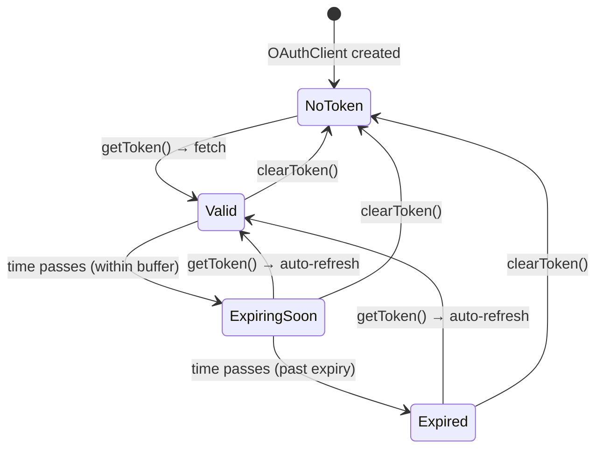

# OAuth Token Lifecycle

The SDK manages OAuth2 `client_credentials` tokens automatically — fetching, caching, proactive refresh before expiry, and retry on 401/403 responses. This page documents the token lifecycle states and how the SDK handles each transition.

## How it works

The Management, Model Security, Red Team, and AI Gateway APIs all authenticate with **OAuth2 client credentials**: you present a client ID + secret, the auth server hands back a short-lived bearer token (Strata Cloud Manager issues ~900s tokens), and every API call carries that token. Tokens expire, so something has to fetch, cache, and refresh them.

That "something" is `OAuthClient`, and **for normal use you never touch it** — `ManagementClient` (and the other OAuth clients) embed one and handle the whole cycle for you. This page exists for the cases where you _do_ want visibility or control: health checks, custom auth flows, or just understanding what happens under load. Note that the embedded instance is private — `ManagementClient` does not expose it or accept `tokenBufferMs` / `onTokenRefresh` — so a standalone `OAuthClient` observes its own token cache, not the managed client's.

The model is a small state machine with one knob — the **buffer window**:

- A token is **Valid** right after it's fetched and stays cached (zero network calls) until it nears expiry.
- The **buffer** (default 30s) marks a token **Expiring Soon** _before_ it actually expires, so the next call refreshes proactively rather than failing.
- If a token somehow expires anyway — or gets revoked server-side — a `401`/`403` triggers a one-time refresh-and-retry.

Two guarantees worth knowing: concurrent calls that need a refresh are **deduplicated** into a single token fetch (no thundering herd), and `getTokenInfo()` lets you inspect state **without ever exposing the raw token**.

## Token States



| State             | `isExpired` | `isExpiringSoon` | `isValid` | `getToken()` behavior             |
| ----------------- | ----------- | ---------------- | --------- | --------------------------------- |
| **No Token**      | `true`      | `true`           | `false`   | Fetches new token from endpoint   |
| **Valid**         | `false`     | `false`          | `true`    | Returns cached token (no network) |
| **Expiring Soon** | `false`     | `true`           | `false`   | Fetches new token proactively     |
| **Expired**       | `true`      | `true`           | `false`   | Fetches new token                 |

The **buffer window** determines when a token transitions from Valid to Expiring Soon. With the default 30s buffer and Strata Cloud Manager's 900s token TTL, a token is treated as expiring soon from the 870s mark, and the next `getToken()` (or API call) after that point fetches a fresh one — well before any API call would fail. There is no background timer; refresh is lazy and happens on demand.

## Inspecting Token State

```ts
import { OAuthClient } from '@cdot65/prisma-airs-sdk';

const oauth = new OAuthClient({
  clientId: 'your-client-id',
  clientSecret: 'your-client-secret',
  tsgId: '1234567890',
  tokenBufferMs: 60_000, // refresh 60s before expiry (default: 30s)
});

// Snapshot of current state (never exposes the actual token)
const info = oauth.getTokenInfo();
// {
//   hasToken: true,
//   isValid: true,
//   isExpired: false,
//   isExpiringSoon: false,
//   expiresInMs: 840000,
//   expiresAt: 1741448400000
// }

// Individual checks
oauth.isTokenExpired(); // past absolute expiry time?
oauth.isTokenExpiringSoon(); // within configured buffer?
oauth.isTokenExpiringSoon(120_000); // within custom 2-minute buffer?
```

## Monitoring Token Refreshes

The `onTokenRefresh` callback fires after every successful token fetch, including the initial one:

```ts
const oauth = new OAuthClient({
  clientId: 'your-client-id',
  clientSecret: 'your-client-secret',
  tsgId: '1234567890',
  onTokenRefresh: (info) => {
    console.log(`Token refreshed, valid for ${info.expiresInMs / 1000}s`);
    // Send to monitoring, update health checks, etc.
  },
});
```

The callback receives a `TokenInfo` object. If the callback throws, the error is swallowed — it never blocks token delivery.

## Auto-Retry on 401/403

When a management API request receives a **401 Unauthorized** or **403 Forbidden**:

1. The SDK calls `clearToken()` to invalidate the cached token
2. `getToken()` fetches a fresh token from the OAuth endpoint
3. The original request is retried with the new token
4. This happens **once** per request — if the retry also fails, the error propagates

This handles the case where a token expires between the buffer check and the API call, or when the server-side token is revoked.

## Validation Output

The SDK includes a validation script that exercises the full lifecycle with real timing using a local mock OAuth server and a local mock management API. A standalone `OAuthClient` gets 5s tokens with a 3s buffer for the timing phases; a `ManagementClient` pointed at the same mocks (with SCM-like 900s tokens, since it uses the default 30s buffer) drives the 401/403 phases through the real request pipeline. No credentials or `.env` file are needed — run it from the repository root:

```bash
npx tsx docs-site/examples/oauth-lifecycle-validation.ts
```

<details>
<summary>Full validation output (captured 2026-09-01 — click to expand)</summary>

```
═══════════════════════════════════════════════════════════════
  OAuth Token Lifecycle Validation
  Token TTL: 5s  |  Buffer: 3s
═══════════════════════════════════════════════════════════════

[T+  0.0s] SETUP        Mock token server on port 45593
[T+  0.0s] SETUP        Mock API server on port 41779

── Phase 1: Pre-fetch state ──────────────────────────────

[T+  0.0s]   INFO       Before any token fetch:
[T+  0.0s]   INFO         hasToken       = false
[T+  0.0s]   INFO         isValid        = false
[T+  0.0s]   INFO         isExpired      = true
[T+  0.0s]   INFO         isExpiringSoon = true
[T+  0.0s]   INFO         expiresInMs    = 0
[T+  0.0s]   INFO         expiresAt      = N/A
[T+  0.0s]   PASS       ✓ No token before first fetch
[T+  0.0s]   PASS       ✓ isTokenExpired() true before fetch
[T+  0.0s]   PASS       ✓ isTokenExpiringSoon() true before fetch
[T+  0.0s]   PASS       ✓ expiresInMs is 0 before fetch

── Phase 2: Initial token fetch ─────────────────────────

[T+  0.0s]   SERVER     Issued token #1: mock-token-1 to test-client (TTL=5s)
[T+  0.0s]   CALLBACK   onTokenRefresh fired — expiresInMs=5000
[T+  0.0s] PHASE 2      Got token: mock-token-1
[T+  0.0s]   INFO       After first fetch:
[T+  0.0s]   INFO         hasToken       = true
[T+  0.0s]   INFO         isValid        = true
[T+  0.0s]   INFO         isExpired      = false
[T+  0.0s]   INFO         isExpiringSoon = false
[T+  0.0s]   INFO         expiresInMs    = 5000
[T+  0.0s]   INFO         expiresAt      = 2026-09-01T16:22:19.886Z
[T+  0.0s]   PASS       ✓ First token is mock-token-1
[T+  0.0s]   PASS       ✓ hasToken is true
[T+  0.0s]   PASS       ✓ isValid is true
[T+  0.0s]   PASS       ✓ isExpired is false
[T+  0.0s]   PASS       ✓ isExpiringSoon is false
[T+  0.0s]   PASS       ✓ expiresInMs > 0 (got 5000)
[T+  0.0s]   PASS       ✓ Only 1 server request so far

── Phase 3: Token caching (no re-fetch within TTL) ──────

[T+  0.0s] PHASE 3      Subsequent getToken() returned: mock-token-1, mock-token-1
[T+  0.0s]   PASS       ✓ Cached token returned (call 2)
[T+  0.0s]   PASS       ✓ Cached token returned (call 3)
[T+  0.0s]   PASS       ✓ Still only 1 server request (token cached)

── Phase 4: Wait 2.2s for buffer window ─────────

[T+  0.0s] PHASE 4      Sleeping 2.2s to reach buffer window...
[T+  2.2s]   INFO       After entering buffer window:
[T+  2.2s]   INFO         hasToken       = true
[T+  2.2s]   INFO         isValid        = false
[T+  2.2s]   INFO         isExpired      = false
[T+  2.2s]   INFO         isExpiringSoon = true
[T+  2.2s]   INFO         expiresInMs    = 2798
[T+  2.2s]   INFO         expiresAt      = 2026-09-01T16:22:19.886Z
[T+  2.2s]   PASS       ✓ isTokenExpiringSoon() true in buffer window
[T+  2.2s]   PASS       ✓ TokenInfo.isExpiringSoon is true
[T+  2.2s]   PASS       ✓ isValid is false (within buffer)
[T+  2.2s]   SERVER     Issued token #2: mock-token-2 to test-client (TTL=5s)
[T+  2.2s]   CALLBACK   onTokenRefresh fired — expiresInMs=5000
[T+  2.2s] PHASE 4      getToken() after buffer window: mock-token-2
[T+  2.2s]   PASS       ✓ Auto-refreshed to mock-token-2
[T+  2.2s]   PASS       ✓ Second server request for refresh
[T+  2.2s]   INFO       After automatic refresh:
[T+  2.2s]   INFO         hasToken       = true
[T+  2.2s]   INFO         isValid        = true
[T+  2.2s]   INFO         isExpired      = false
[T+  2.2s]   INFO         isExpiringSoon = false
[T+  2.2s]   INFO         expiresInMs    = 5000
[T+  2.2s]   INFO         expiresAt      = 2026-09-01T16:22:22.093Z
[T+  2.2s]   PASS       ✓ Refreshed token is valid
[T+  2.2s]   PASS       ✓ Refreshed token not expired

── Phase 5: Wait 6s for full expiry ──────────────────

[T+  2.2s] PHASE 5      Sleeping 6s for full token expiry...
[T+  8.2s]   INFO       After full expiry:
[T+  8.2s]   INFO         hasToken       = true
[T+  8.2s]   INFO         isValid        = false
[T+  8.2s]   INFO         isExpired      = true
[T+  8.2s]   INFO         isExpiringSoon = true
[T+  8.2s]   INFO         expiresInMs    = 0
[T+  8.2s]   INFO         expiresAt      = 2026-09-01T16:22:22.093Z
[T+  8.2s]   PASS       ✓ isTokenExpired() true after expiry
[T+  8.2s]   PASS       ✓ TokenInfo.isExpired is true
[T+  8.2s]   PASS       ✓ expiresInMs is 0 after expiry
[T+  8.2s]   SERVER     Issued token #3: mock-token-3 to test-client (TTL=5s)
[T+  8.2s]   CALLBACK   onTokenRefresh fired — expiresInMs=5000
[T+  8.2s] PHASE 5      getToken() after expiry: mock-token-3
[T+  8.2s]   PASS       ✓ Auto-refreshed to mock-token-3 after expiry
[T+  8.2s]   PASS       ✓ Third server request

── Phase 6: 401 auto-retry with token refresh ───────────

[T+  8.2s]   SERVER     Issued token #4: mock-token-4 to mgmt-client (TTL=900s)
[T+  8.2s]   API        GET /v1/mgmt/profiles/tsg/1234567890  auth=Bearer mock-token-4
[T+  8.2s]   API        Responding 401 to simulate expired token
[T+  8.3s]   SERVER     Issued token #5: mock-token-5 to mgmt-client (TTL=900s)
[T+  8.3s]   API        GET /v1/mgmt/profiles/tsg/1234567890  auth=Bearer mock-token-5
[T+  8.3s] PHASE 6      profiles.list() resolved after a 401: 0 profiles
[T+  8.3s]   PASS       ✓ 401 auto-retry succeeded with fresh token
[T+  8.3s]   PASS       ✓ Initial fetch + one refresh after 401 (fetches 3 → 5)

── Phase 7: 403 auto-retry with token refresh ───────────

[T+  8.3s]   API        GET /v1/mgmt/profiles/tsg/1234567890  auth=Bearer mock-token-5
[T+  8.3s]   API        Responding 403 to simulate expired token
[T+  8.3s]   SERVER     Issued token #6: mock-token-6 to mgmt-client (TTL=900s)
[T+  8.3s]   API        GET /v1/mgmt/profiles/tsg/1234567890  auth=Bearer mock-token-6
[T+  8.3s] PHASE 7      profiles.list() resolved after a 403: 0 profiles
[T+  8.3s]   PASS       ✓ 403 auto-retry succeeded with fresh token
[T+  8.3s]   PASS       ✓ Cached token reused, then exactly one refresh after 403 (fetches 5 → 6)

── Phase 8: clearToken() → forced re-fetch ──────────────

[T+  8.3s]   INFO       After clearToken():
[T+  8.3s]   INFO         hasToken       = false
[T+  8.3s]   INFO         isValid        = false
[T+  8.3s]   INFO         isExpired      = true
[T+  8.3s]   INFO         isExpiringSoon = true
[T+  8.3s]   INFO         expiresInMs    = 0
[T+  8.3s]   INFO         expiresAt      = N/A
[T+  8.3s]   PASS       ✓ No token after clearToken()
[T+  8.3s]   PASS       ✓ isTokenExpired() true after clear
[T+  8.3s]   SERVER     Issued token #7: mock-token-7 to test-client (TTL=5s)
[T+  8.3s]   CALLBACK   onTokenRefresh fired — expiresInMs=5000
[T+  8.3s] PHASE 8      getToken() after clearToken(): mock-token-7
[T+  8.3s]   PASS       ✓ New server request after clearToken()
[T+  8.3s]   PASS       ✓ Fresh token is valid

── Phase 9: Custom buffer override ──────────────────────

[T+  8.3s]   PASS       ✓ isTokenExpiringSoon(6000ms) true with large custom buffer
[T+  8.3s]   PASS       ✓ isTokenExpiringSoon(100ms) false with tiny buffer

── Phase 10: onTokenRefresh callback audit ──────────────

[T+  8.3s] PHASE 10     Total onTokenRefresh callbacks (standalone client): 4
[T+  8.3s] PHASE 10     Token fetches — standalone: 4, managed: 3
[T+  8.3s]   PASS       ✓ Callback count (4) matches standalone fetch count (4)
[T+  8.3s]   PASS       ✓ Callback #1: hasToken=true
[T+  8.3s]   PASS       ✓ Callback #1: expiresInMs=5000
[T+  8.3s]   PASS       ✓ Callback #2: hasToken=true
[T+  8.3s]   PASS       ✓ Callback #2: expiresInMs=5000
[T+  8.3s]   PASS       ✓ Callback #3: hasToken=true
[T+  8.3s]   PASS       ✓ Callback #3: expiresInMs=5000
[T+  8.3s]   PASS       ✓ Callback #4: hasToken=true
[T+  8.3s]   PASS       ✓ Callback #4: expiresInMs=5000

═══════════════════════════════════════════════════════════════
  Validation Complete
  Total token fetches: 7 (standalone 4, managed 3)
  Total callbacks: 4
  Duration: 8.3s
  Result: ALL PASSED
═══════════════════════════════════════════════════════════════
```

</details>
### What the validation proves

| Phase | What it tests                                                                                                          | Real timing?             |
| ----- | ---------------------------------------------------------------------------------------------------------------------- | ------------------------ |
| 1     | Pre-fetch state — all fields report "no token"                                                                         | N/A                      |
| 2     | Initial fetch — token acquired, state transitions to Valid                                                             | Yes                      |
| 3     | Caching — repeated `getToken()` returns cached token, no network                                                       | Yes                      |
| 4     | Buffer window — after 2.2s of a 5s token with 3s buffer, `isExpiringSoon` flips and `getToken()` proactively refreshes | **Yes (2.2s real wait)** |
| 5     | Full expiry — after 6s, `isExpired` flips and `getToken()` fetches fresh token                                         | **Yes (6s real wait)**   |
| 6     | 401 auto-retry — `ManagementClient.profiles.list()` gets a 401, the SDK clears the token, fetches a new one, and retries (with `numRetries: 0`, proving the auth retry is free) | Yes (mock API)           |
| 7     | 403 auto-retry — same path with a 403; the cached token is reused first, then exactly one refresh                       | Yes (mock API)           |
| 8     | `clearToken()` — invalidates cache, next `getToken()` forces fresh fetch                                               | Yes                      |
| 9     | Custom buffer — `isTokenExpiringSoon(ms)` respects override                                                            | Yes                      |
| 10    | Callback audit — `onTokenRefresh` fires exactly once per fetch                                                         | Yes                      |

## Get the most out of it

:::tip[Let the SDK do the work]
For 99% of use cases you don't need `OAuthClient` at all — just construct a `ManagementClient` and make calls. Fetch, cache, refresh, and 401/403 retry all happen automatically. Reach for a standalone `OAuthClient` only when you need a bearer token for your own HTTP calls, want to observe refreshes against your own token source, or are testing a custom auth flow — it does not hook into the instance a `ManagementClient` owns.
:::
:::warning[Size the buffer to your token TTL]
The default 30s buffer suits SCM's ~900s tokens. Choose a buffer comfortably **below** the token TTL: if you point the SDK at an auth server that issues tokens shorter than about a minute, _reduce_ `tokenBufferMs` (the validation script above uses 3s for 5s tokens). If you set the buffer _larger than the token TTL_, the token is "expiring soon" the instant it's issued — and you'll refetch on every call.
:::
:::note[The 401/403 retry happens once]
On `401`/`403` the SDK clears the token, fetches a fresh one, and retries the request a **single** time. If the retry also fails, the error propagates — a persistent `403` means a real permissions or credentials problem, not an expiry hiccup. Don't wrap calls in your own refresh loop; you'd just duplicate this.
:::
**Inspect state cheaply.** `getTokenInfo()`, `isTokenExpired()`, and `isTokenExpiringSoon()` are pure reads — they never trigger a network fetch. Poll them freely for health endpoints or dashboards without burning token requests.

**Use `onTokenRefresh` for observability, not control flow.** It's the right hook to emit a metric or log line on each refresh. Keep it fast and side-effect-only: if the callback throws, the error is swallowed so it can never block token delivery — meaning you also can't rely on it to gate anything.

**Concurrency is handled.** Fire many requests at once after a cold start (or right at expiry) and they collapse into one token fetch, not N. You don't need to serialize or pre-warm.

**`clearToken()` is your reset.** Rotated the client secret, or want to force a clean fetch in a test? Call `clearToken()` — the next `getToken()` (or API call) fetches fresh.

## Full reference

`OAuthClient`, `TokenInfo`, and the OAuth-backed clients — with full signatures and examples — are in the [Full API reference](../reference/api/index.md).
