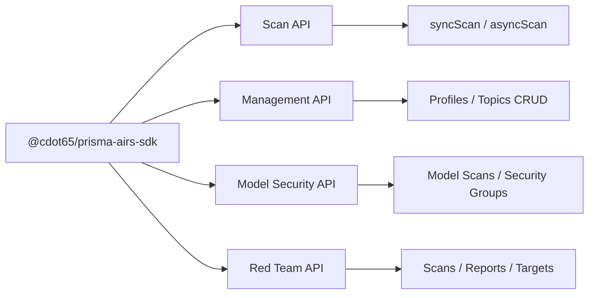

# Prisma AIRS SDK

**TypeScript SDK for Palo Alto Networks Prisma AIRS**

Type-safe clients for all four AIRS service domains: real-time content scanning, security configuration management, model security analysis, and AI red teaming. The SDK targets Node.js 18+, uses native `fetch` and `crypto` for HTTP/auth plumbing, and ships dual ESM/CJS builds with TypeScript declarations.

## Features

- **Real-Time Content Scanning** — Synchronous and asynchronous scanning of AI prompts and responses. Detect prompt injection, toxic content, data leaks, and malicious URLs inline.
- **Security Management** — CRUD for security profiles, custom topics, scan API keys, customer apps, DLP resources, deployment profiles, dashboard data, and scan logs.
- **Model Security** — Scan ML models for supply chain threats: malicious code execution, backdoors, unapproved file formats. Manage security groups and rules.
- **AI Red Teaming** — Run automated red team scans against AI targets. Static attack libraries, dynamic agent-based testing, custom prompt sets, and comprehensive reporting.
- **Type-Safe Everything** — Zod response schemas with `.passthrough()` for forward compatibility, exported TypeScript types, and generated TypeDoc API reference pages.
- **Small Runtime Footprint** — `zod` is the only runtime dependency. Native `fetch` + `crypto` power HTTP calls, signing, OAuth bearer tokens, and retry behavior.

## Four Independent APIs

## Get Started

- **[Install](getting-started/installation)** — Install the SDK and verify imports.
- **[Quick Start](getting-started/quick-start)** — Use the scan, management, model security, and red team clients.
- **[Configure](getting-started/configuration)** — Environment variables, constructor options, auth methods, and endpoint setup.
- **[Development](developer/development)** — Local scripts, tests, docs generation, and CI workflow.
- **[API Reference](reference/api/)** — Generated method signatures, types, schemas, and examples.
