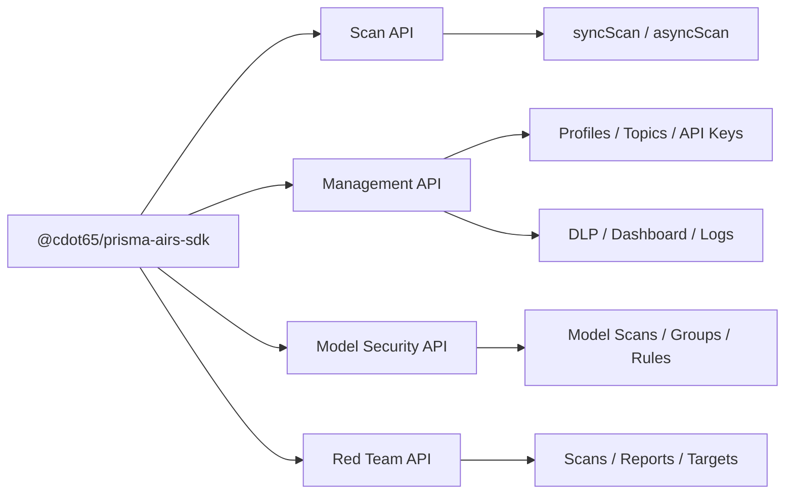

# Prisma AIRS SDK

**TypeScript SDK for Palo Alto Networks Prisma AIRS**

Type-safe clients for all four AIRS service domains — real-time content scanning, security configuration management, model security analysis, and AI red teaming. Zero external HTTP dependencies. Native `fetch` + `crypto`. ESM-first with dual CJS/ESM exports.

## Features

- **Real-Time Content Scanning** — Synchronous and asynchronous scanning of AI prompts and responses. Detect prompt injection, toxic content, data leaks, and malicious URLs inline.
- **Security Management** — Manage security profiles, custom topics, API keys, dashboard data, and DLP resources through OAuth2 clients.
- **Model Security** — Scan ML models for supply chain threats: malicious code execution, backdoors, unapproved file formats. Manage security groups and rules.
- **AI Red Teaming** — Run automated red team scans against AI targets. Static attack libraries, dynamic agent-based testing, custom prompt sets, and comprehensive reporting.
- **Type-Safe Everything** — Exported TypeScript types, enum const objects, Zod schemas with `.passthrough()` for forward compatibility, and JSDoc examples on public symbols.
- **Zero Dependencies** — Native `fetch` + `crypto` only. No external HTTP libraries. Exponential backoff retry built in. ES2022 target, Node 18+.

## Four Independent APIs

## Get Started

- **[Install](getting-started/installation.md)** — Install the SDK, configure credentials, and connect to AIRS.
- **[Quick Start](getting-started/quick-start)** — Scanning, management, and more in under 5 minutes.
- **[Configure](getting-started/configuration)** — Environment variables, auth methods, and endpoint setup.
- **[API Reference](reference/api/index.md)** — Complete method signatures, types, enums, and error handling.
