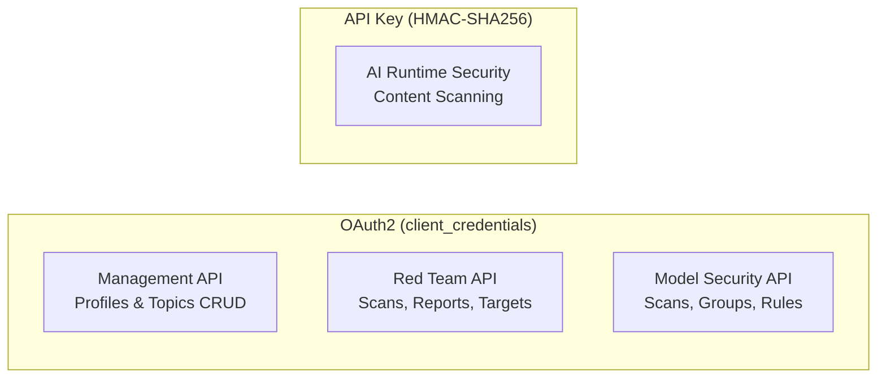

# Quick Start

## Authentication Overview

Prisma AIRS has two authentication methods. Understanding which applies where is key:

| Auth Method                     | Used By                                                                  |
| ------------------------------- | ------------------------------------------------------------------------ |
| **OAuth2** (client_credentials) | Management CRUD for all 3 services, Red Team scans, Model Security scans |
| **API Key** (HMAC-SHA256)       | AI Runtime Security scans only                                           |



In practice, if you set `PANW_MGMT_CLIENT_ID`, `PANW_MGMT_CLIENT_SECRET`, and `PANW_MGMT_TSG_ID`, all OAuth2 services share those credentials automatically. The only separate credential is the API key for AI Runtime Security content scanning.

---

## Management API — Configuration CRUD

The Management API handles CRUD operations for **all three Prisma AIRS services**. It uses OAuth2 under the hood via the SDK's built-in `OAuthClient` (token caching, proactive refresh, and 401/403 auto-retry are handled automatically).

### Security Profiles (AI Runtime Security config)

```ts
import { ManagementClient } from '@cdot65/prisma-airs-sdk';

const client = new ManagementClient(); // reads PANW_MGMT_* env vars

// List profiles
const { ai_profiles } = await client.profiles.list();
for (const p of ai_profiles) {
  console.log(p.profile_name, p.profile_id);
}

// Create a custom topic
const topic = await client.topics.create({
  topic_name: 'credit-card-numbers',
  description: 'Detects credit card numbers',
  examples: ['4111-1111-1111-1111', '5500 0000 0000 0004'],
});
```

### Red Team Targets (Red Team config)

```ts
import { RedTeamClient } from '@cdot65/prisma-airs-sdk';

const client = new RedTeamClient(); // falls back to PANW_MGMT_* env vars

// List targets
const targets = await client.targets.list();
for (const t of targets.data ?? []) {
  console.log(t.name, t.target_type, t.status);
}
```

### Security Groups (Model Security config)

```ts
import { ModelSecurityClient } from '@cdot65/prisma-airs-sdk';

const client = new ModelSecurityClient(); // falls back to PANW_MGMT_* env vars

// List security groups
const groups = await client.securityGroups.list();
for (const g of groups.security_groups) {
  console.log(g.name, g.state);
}
```

---

## AI Runtime Security — Content Scanning

This is the **only service that uses API key authentication** instead of OAuth2.

```ts
import { init, Scanner, Content } from '@cdot65/prisma-airs-sdk';

// Initialize with API key (not OAuth2)
init({ apiKey: 'your-api-key' });

const scanner = new Scanner();
const content = new Content({ prompt: 'Tell me how to hack a server' });

const result = await scanner.syncScan({ profile_name: 'my-profile' }, content);

console.log(result.category); // 'malicious'
console.log(result.action); // 'block'
```

---

## Red Team API — AI Red Teaming

Uses OAuth2 for both management (targets, custom attacks) and data plane (scans, reports) operations.

```ts
import { RedTeamClient } from '@cdot65/prisma-airs-sdk';

const client = new RedTeamClient(); // OAuth2 via PANW_MGMT_* env vars

// List scans (data plane — OAuth2)
const scans = await client.scans.list({ limit: 5 });
for (const job of scans.data ?? []) {
  console.log(job.name, job.status, job.job_type);
}

// Get attack categories (data plane — OAuth2)
const categories = await client.scans.getCategories();
for (const cat of categories) {
  console.log(cat.display_name, cat.sub_categories.length, 'subcategories');
}
```

---

## Model Security API — Model Scanning

Uses OAuth2 for both management (security groups, rules) and data plane (scans, evaluations) operations.

```ts
import { ModelSecurityClient } from '@cdot65/prisma-airs-sdk';

const client = new ModelSecurityClient(); // OAuth2 via PANW_MGMT_* env vars

// List scans (data plane — OAuth2)
const scans = await client.scans.list({ limit: 10 });
for (const scan of scans.scans) {
  console.log(scan.uuid, scan.eval_outcome);
}

// List security rules (management — OAuth2)
const rules = await client.securityRules.list();
for (const rule of rules.security_rules) {
  console.log(rule.name, rule.rule_type);
}
```

---

## Running Examples

```bash
cp .env.example .env   # fill in credentials

# AI Runtime Security (API key auth)
npm run example:scan
npm run example:async-scan
npm run example:query

# Management CRUD (OAuth2)
npm run example:mgmt-auth
npm run example:mgmt-profiles
npm run example:mgmt-topics

# Model Security (OAuth2)
npm run example:model-sec-scans

# Red Team (OAuth2)
npm run example:red-team-scans
npm run example:red-team-targets

# OAuth lifecycle validation
npm run example:oauth-lifecycle
```
