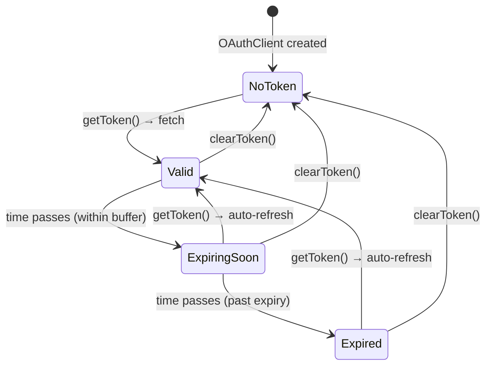

# OAuth Token Lifecycle

The SDK manages OAuth2 `client_credentials` tokens automatically — fetching, caching, proactive refresh before expiry, and retry on 401/403 responses. This page documents the token lifecycle states and how the SDK handles each transition.

## Token States



| State             | `isExpired` | `isExpiringSoon` | `isValid` | `getToken()` behavior             |
| ----------------- | ----------- | ---------------- | --------- | --------------------------------- |
| **No Token**      | `true`      | `true`           | `false`   | Fetches new token from endpoint   |
| **Valid**         | `false`     | `false`          | `true`    | Returns cached token (no network) |
| **Expiring Soon** | `false`     | `true`           | `false`   | Fetches new token proactively     |
| **Expired**       | `true`      | `true`           | `false`   | Fetches new token                 |

The **buffer window** determines when a token transitions from Valid to Expiring Soon. With the default 30s buffer and Strata Cloud Manager's 900s token TTL, the SDK refreshes at the 870s mark — well before any API call would fail.

## Inspecting Token State

```ts
import { OAuthClient } from '@cdot65/prisma-airs-sdk';

const oauth = new OAuthClient({
  clientId: 'your-client-id',
  clientSecret: 'your-client-secret',
  tsgId: '1234567890',
  tokenBufferMs: 60_000, // refresh 60s before expiry (default: 30s)
});

// Snapshot of current state (never exposes the actual token)
const info = oauth.getTokenInfo();
// {
//   hasToken: true,
//   isValid: true,
//   isExpired: false,
//   isExpiringSoon: false,
//   expiresInMs: 840000,
//   expiresAt: 1741448400000
// }

// Individual checks
oauth.isTokenExpired(); // past absolute expiry time?
oauth.isTokenExpiringSoon(); // within configured buffer?
oauth.isTokenExpiringSoon(120_000); // within custom 2-minute buffer?
```

## Monitoring Token Refreshes

The `onTokenRefresh` callback fires after every successful token fetch, including the initial one:

```ts
const oauth = new OAuthClient({
  clientId: 'your-client-id',
  clientSecret: 'your-client-secret',
  tsgId: '1234567890',
  onTokenRefresh: (info) => {
    console.log(`Token refreshed, valid for ${info.expiresInMs / 1000}s`);
    // Send to monitoring, update health checks, etc.
  },
});
```

The callback receives a `TokenInfo` object. If the callback throws, the error is swallowed — it never blocks token delivery.

## Auto-Retry on 401/403

When a management API request receives a **401 Unauthorized** or **403 Forbidden**:

1. The SDK calls `clearToken()` to invalidate the cached token
2. `getToken()` fetches a fresh token from the OAuth endpoint
3. The original request is retried with the new token
4. This happens **once** per request — if the retry also fails, the error propagates

This handles the case where a token expires between the buffer check and the API call, or when the server-side token is revoked.

## Validation Output

The SDK includes a validation script that exercises the full lifecycle with real timing using a local mock OAuth server (5s tokens, 3s buffer). Run it with:

```bash
npm run example:oauth-lifecycle
```

??? example "Full validation output (click to expand)"

    ```
    ═══════════════════════════════════════════════════════════════
      OAuth Token Lifecycle Validation
      Token TTL: 5s  |  Buffer: 3s
    ═══════════════════════════════════════════════════════════════

    [T+  0.0s] SETUP        Mock token server on port 56235
    [T+  0.0s] SETUP        Mock API server on port 56236

    ── Phase 1: Pre-fetch state ──────────────────────────────

    [T+  0.0s]   INFO       Before any token fetch:
    [T+  0.0s]   INFO         hasToken       = false
    [T+  0.0s]   INFO         isValid        = false
    [T+  0.0s]   INFO         isExpired      = true
    [T+  0.0s]   INFO         isExpiringSoon = true
    [T+  0.0s]   INFO         expiresInMs    = 0
    [T+  0.0s]   INFO         expiresAt      = N/A
    [T+  0.0s]   PASS       ✓ No token before first fetch
    [T+  0.0s]   PASS       ✓ isTokenExpired() true before fetch
    [T+  0.0s]   PASS       ✓ isTokenExpiringSoon() true before fetch
    [T+  0.0s]   PASS       ✓ expiresInMs is 0 before fetch

    ── Phase 2: Initial token fetch ─────────────────────────

    [T+  0.0s]   SERVER     Issued token #1: mock-token-1 (TTL=5s)
    [T+  0.0s]   CALLBACK   onTokenRefresh fired — expiresInMs=5000
    [T+  0.0s] PHASE 2      Got token: mock-token-1
    [T+  0.0s]   INFO       After first fetch:
    [T+  0.0s]   INFO         hasToken       = true
    [T+  0.0s]   INFO         isValid        = true
    [T+  0.0s]   INFO         isExpired      = false
    [T+  0.0s]   INFO         isExpiringSoon = false
    [T+  0.0s]   INFO         expiresInMs    = 5000
    [T+  0.0s]   INFO         expiresAt      = 2026-03-08T14:31:39.001Z
    [T+  0.0s]   PASS       ✓ First token is mock-token-1
    [T+  0.0s]   PASS       ✓ hasToken is true
    [T+  0.0s]   PASS       ✓ isValid is true
    [T+  0.0s]   PASS       ✓ isExpired is false
    [T+  0.0s]   PASS       ✓ isExpiringSoon is false
    [T+  0.0s]   PASS       ✓ expiresInMs > 0 (got 5000)
    [T+  0.0s]   PASS       ✓ Only 1 server request so far

    ── Phase 3: Token caching (no re-fetch within TTL) ──────

    [T+  0.0s] PHASE 3      Subsequent getToken() returned: mock-token-1, mock-token-1
    [T+  0.0s]   PASS       ✓ Cached token returned (call 2)
    [T+  0.0s]   PASS       ✓ Cached token returned (call 3)
    [T+  0.0s]   PASS       ✓ Still only 1 server request (token cached)

    ── Phase 4: Wait 2.2s for buffer window ─────────

    [T+  0.0s] PHASE 4      Sleeping 2.2s to reach buffer window...
    [T+  2.2s]   INFO       After entering buffer window:
    [T+  2.2s]   INFO         hasToken       = true
    [T+  2.2s]   INFO         isValid        = false
    [T+  2.2s]   INFO         isExpired      = false
    [T+  2.2s]   INFO         isExpiringSoon = true
    [T+  2.2s]   INFO         expiresInMs    = 2799
    [T+  2.2s]   INFO         expiresAt      = 2026-03-08T14:31:39.001Z
    [T+  2.2s]   PASS       ✓ isTokenExpiringSoon() true in buffer window
    [T+  2.2s]   PASS       ✓ TokenInfo.isExpiringSoon is true
    [T+  2.2s]   PASS       ✓ isValid is false (within buffer)
    [T+  2.2s]   SERVER     Issued token #2: mock-token-2 (TTL=5s)
    [T+  2.2s]   CALLBACK   onTokenRefresh fired — expiresInMs=5000
    [T+  2.2s] PHASE 4      getToken() after buffer window: mock-token-2
    [T+  2.2s]   PASS       ✓ Auto-refreshed to mock-token-2
    [T+  2.2s]   PASS       ✓ Second server request for refresh
    [T+  2.2s]   INFO       After automatic refresh:
    [T+  2.2s]   INFO         hasToken       = true
    [T+  2.2s]   INFO         isValid        = true
    [T+  2.2s]   INFO         isExpired      = false
    [T+  2.2s]   INFO         isExpiringSoon = false
    [T+  2.2s]   INFO         expiresInMs    = 4999
    [T+  2.2s]   INFO         expiresAt      = 2026-03-08T14:31:41.204Z
    [T+  2.2s]   PASS       ✓ Refreshed token is valid
    [T+  2.2s]   PASS       ✓ Refreshed token not expired

    ── Phase 5: Wait 6s for full expiry ──────────────────

    [T+  2.2s] PHASE 5      Sleeping 6s for full token expiry...
    [T+  8.2s]   INFO       After full expiry:
    [T+  8.2s]   INFO         hasToken       = true
    [T+  8.2s]   INFO         isValid        = false
    [T+  8.2s]   INFO         isExpired      = true
    [T+  8.2s]   INFO         isExpiringSoon = true
    [T+  8.2s]   INFO         expiresInMs    = 0
    [T+  8.2s]   INFO         expiresAt      = 2026-03-08T14:31:41.204Z
    [T+  8.2s]   PASS       ✓ isTokenExpired() true after expiry
    [T+  8.2s]   PASS       ✓ TokenInfo.isExpired is true
    [T+  8.2s]   PASS       ✓ expiresInMs is 0 after expiry
    [T+  8.2s]   SERVER     Issued token #3: mock-token-3 (TTL=5s)
    [T+  8.2s]   CALLBACK   onTokenRefresh fired — expiresInMs=5000
    [T+  8.2s] PHASE 5      getToken() after expiry: mock-token-3
    [T+  8.2s]   PASS       ✓ Auto-refreshed to mock-token-3 after expiry
    [T+  8.2s]   PASS       ✓ Third server request

    ── Phase 6: 401 auto-retry with token refresh ───────────

    [T+  8.2s]   API        GET /v1/test-401  auth=Bearer mock-token-3
    [T+  8.2s]   API        Responding 401 to simulate expired token
    [T+  8.2s]   SERVER     Issued token #4: mock-token-4 (TTL=5s)
    [T+  8.2s]   CALLBACK   onTokenRefresh fired — expiresInMs=5000
    [T+  8.2s]   API        GET /v1/test-401  auth=Bearer mock-token-4
    [T+  8.2s] PHASE 6      401 retry result: status=200
    [T+  8.2s]   PASS       ✓ 401 auto-retry succeeded with fresh token
    [T+  8.2s]   PASS       ✓ Token refreshed after 401 (total fetches: 4)

    ── Phase 7: 403 auto-retry with token refresh ───────────

    [T+  8.2s]   API        GET /v1/test-403  auth=Bearer mock-token-4
    [T+  8.2s]   API        Responding 403 to simulate expired token
    [T+  8.2s]   SERVER     Issued token #5: mock-token-5 (TTL=5s)
    [T+  8.2s]   CALLBACK   onTokenRefresh fired — expiresInMs=5000
    [T+  8.2s]   API        GET /v1/test-403  auth=Bearer mock-token-5
    [T+  8.2s] PHASE 7      403 retry result: status=200
    [T+  8.2s]   PASS       ✓ 403 auto-retry succeeded with fresh token
    [T+  8.2s]   PASS       ✓ Token refreshed after 403 (total fetches: 5)

    ── Phase 8: clearToken() → forced re-fetch ──────────────

    [T+  8.2s]   INFO       After clearToken():
    [T+  8.2s]   INFO         hasToken       = false
    [T+  8.2s]   INFO         isValid        = false
    [T+  8.2s]   INFO         isExpired      = true
    [T+  8.2s]   INFO         isExpiringSoon = true
    [T+  8.2s]   INFO         expiresInMs    = 0
    [T+  8.2s]   INFO         expiresAt      = N/A
    [T+  8.2s]   PASS       ✓ No token after clearToken()
    [T+  8.2s]   PASS       ✓ isTokenExpired() true after clear
    [T+  8.2s]   SERVER     Issued token #6: mock-token-6 (TTL=5s)
    [T+  8.2s]   CALLBACK   onTokenRefresh fired — expiresInMs=5000
    [T+  8.2s] PHASE 8      getToken() after clearToken(): mock-token-6
    [T+  8.2s]   PASS       ✓ New server request after clearToken()
    [T+  8.2s]   PASS       ✓ Fresh token is valid

    ── Phase 9: Custom buffer override ──────────────────────

    [T+  8.2s]   PASS       ✓ isTokenExpiringSoon(6000ms) true with large custom buffer
    [T+  8.2s]   PASS       ✓ isTokenExpiringSoon(100ms) false with tiny buffer

    ── Phase 10: onTokenRefresh callback audit ──────────────

    [T+  8.2s] PHASE 10     Total onTokenRefresh callbacks: 6
    [T+  8.2s] PHASE 10     Total token fetches: 6
    [T+  8.2s]   PASS       ✓ Callback count (6) matches fetch count (6)
    [T+  8.2s]   PASS       ✓ Callback #1: hasToken=true
    [T+  8.2s]   PASS       ✓ Callback #1: expiresInMs=5000
    [T+  8.2s]   PASS       ✓ Callback #2: hasToken=true
    [T+  8.2s]   PASS       ✓ Callback #2: expiresInMs=5000
    [T+  8.2s]   PASS       ✓ Callback #3: hasToken=true
    [T+  8.2s]   PASS       ✓ Callback #3: expiresInMs=5000
    [T+  8.2s]   PASS       ✓ Callback #4: hasToken=true
    [T+  8.2s]   PASS       ✓ Callback #4: expiresInMs=5000
    [T+  8.2s]   PASS       ✓ Callback #5: hasToken=true
    [T+  8.2s]   PASS       ✓ Callback #5: expiresInMs=5000
    [T+  8.2s]   PASS       ✓ Callback #6: hasToken=true
    [T+  8.2s]   PASS       ✓ Callback #6: expiresInMs=5000

    ═══════════════════════════════════════════════════════════════
      Validation Complete
      Total token fetches: 6
      Total callbacks: 6
      Duration: 8.2s
      Result: ALL PASSED
    ═══════════════════════════════════════════════════════════════
    ```

### What the validation proves

| Phase | What it tests                                                                                                          | Real timing?             |
| ----- | ---------------------------------------------------------------------------------------------------------------------- | ------------------------ |
| 1     | Pre-fetch state — all fields report "no token"                                                                         | N/A                      |
| 2     | Initial fetch — token acquired, state transitions to Valid                                                             | Yes                      |
| 3     | Caching — repeated `getToken()` returns cached token, no network                                                       | Yes                      |
| 4     | Buffer window — after 2.2s of a 5s token with 3s buffer, `isExpiringSoon` flips and `getToken()` proactively refreshes | **Yes (2.2s real wait)** |
| 5     | Full expiry — after 6s, `isExpired` flips and `getToken()` fetches fresh token                                         | **Yes (6s real wait)**   |
| 6     | 401 auto-retry — API returns 401, SDK clears token, fetches new one, retries request                                   | Yes (mock API)           |
| 7     | 403 auto-retry — same as 401 but with 403 status                                                                       | Yes (mock API)           |
| 8     | `clearToken()` — invalidates cache, next `getToken()` forces fresh fetch                                               | Yes                      |
| 9     | Custom buffer — `isTokenExpiringSoon(ms)` respects override                                                            | Yes                      |
| 10    | Callback audit — `onTokenRefresh` fires exactly once per fetch                                                         | Yes                      |
