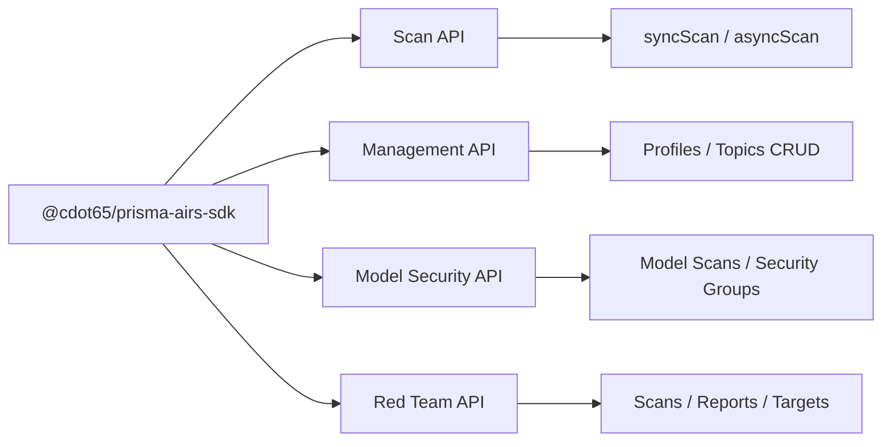

# Prisma AIRS SDK

**Prisma AIRS SDK** is a TypeScript SDK for Palo Alto Networks **AI Runtime Security (AIRS)**. It provides type-safe clients for all four AIRS service domains — real-time content scanning, security configuration management, model security analysis, and AI red teaming.

Zero external HTTP dependencies. Native `fetch` + `crypto`. ESM-first with dual CJS/ESM exports.

---

## Four Independent APIs

---

## Feature Highlights

!!! tip "Real-Time Content Scanning"
Synchronous and asynchronous scanning of AI prompts and responses. Detect prompt injection, toxic content, data leaks, and malicious URLs inline with your application.

!!! tip "Model Security"
Scan ML models for supply chain threats — malicious code execution, backdoors, unapproved file formats. Manage security groups and rules for automated model governance.

!!! tip "AI Red Teaming"
Run automated red team scans against AI targets. Static attack libraries, dynamic agent-based testing, custom prompt sets, and comprehensive reporting with remediation guidance.

!!! tip "Type-Safe Everything"
50 typed enum const objects, ~135 Zod schemas with `.passthrough()` for forward compatibility, and JSDoc on every exported symbol. Full IDE autocompletion out of the box.

---

## Quick Links

|                                                          |                                                                    |
| -------------------------------------------------------- | ------------------------------------------------------------------ |
| **[Getting Started](getting-started/installation.md)**   | Install the SDK, configure credentials, and run your first scan.   |
| **[Scan API](services/scan-api.md)**                     | Real-time content scanning for AI prompts and responses.           |
| **[Management API](services/management-api.md)**         | CRUD for security profiles and custom topics.                      |
| **[Model Security API](services/model-security-api.md)** | Model supply chain scanning and security group management.         |
| **[Red Team API](services/red-team-api.md)**             | Automated red team scanning, reports, targets, and custom attacks. |
| **[API Reference](reference/api-reference.md)**          | Complete method signatures, types, and enums.                      |
